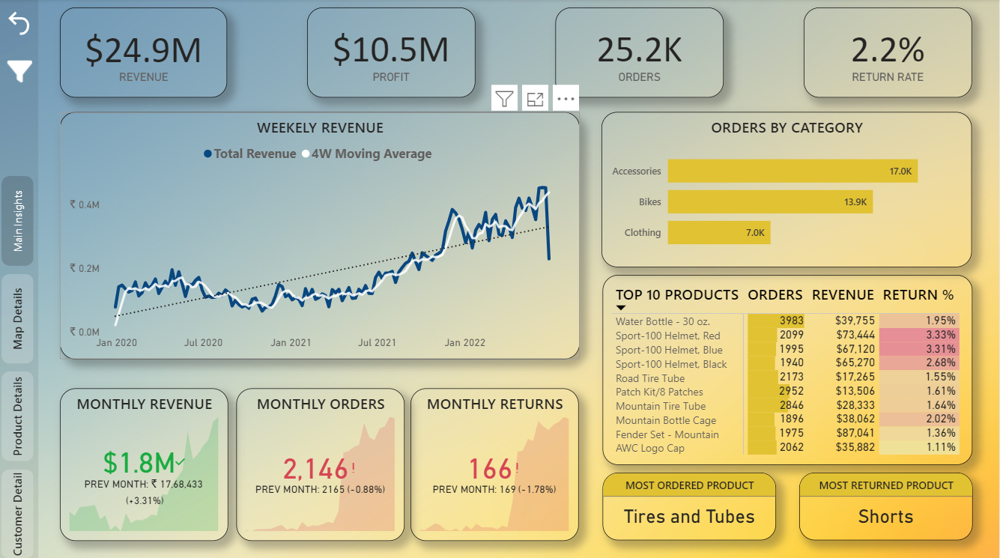
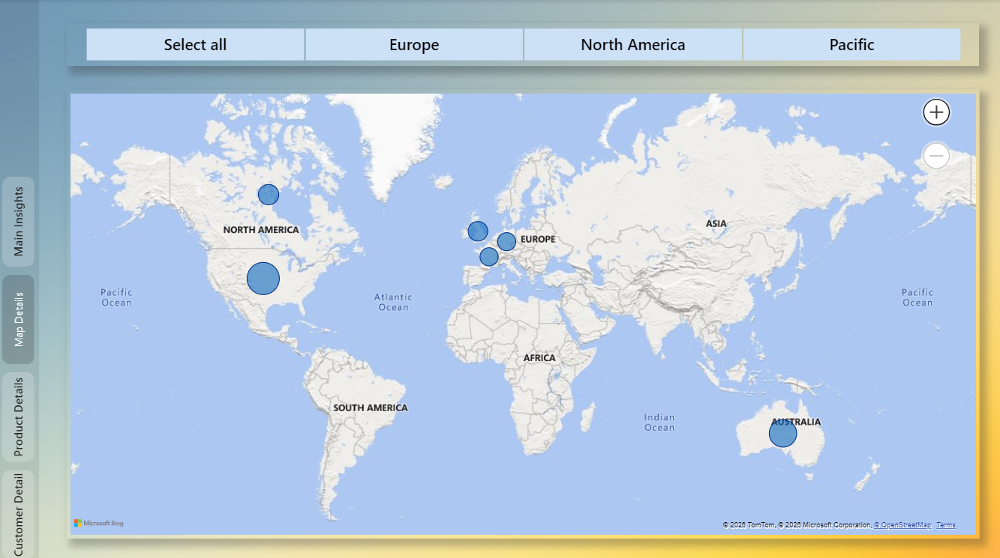
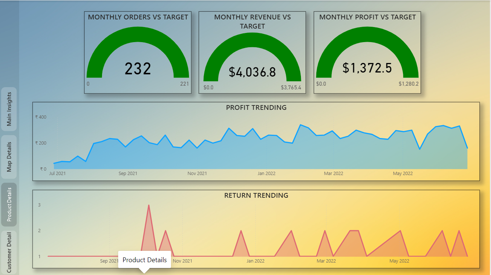
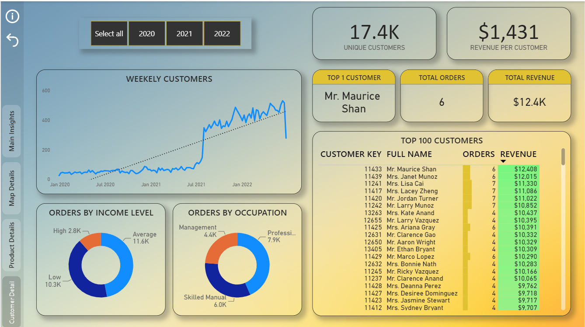

# Power BI Sales Dashboard

## Project Overview

This project demonstrates an end-to-end Power BI workflow, from data preparation and modeling to interactive dashboard creation. It highlights skills in Power Query, DAX, data modeling, and business intelligence.

## ETL & Data Preparation

* Imported and combined multiple CSV files.
* Removed duplicates, errors, blank rows, and handled missing values.
* Standardized data types and column names.
* Split/merged columns and created custom columns.
* Built a Calendar table for time-based analysis.

## Data Modeling

* Designed a Snowflake Schema.
* Created one-to-many relationships using primary and foreign keys.
* Configured single-direction cross filtering.
* Organized the model for efficient reporting.

**Data Model**

## DAX Measures

Created custom measures for business analysis, including:

* Total Orders
* Weekend Orders
* Revenue Target
* Return Rate
* Previous Month Profit
* Average Revenue per Customer
* 90-Day Rolling Profit

## Dashboard Features

* KPI Cards
* Line, Bar, Donut, and Map visuals
* Tables and Matrix
* Slicers
* Drill-through
* Custom Tooltips
* Page Navigation using Buttons & Bookmarks

## Dashboard Pages

### Executive Summary

Business KPIs, revenue trends, top products, and performance overview.

### Sales by Region

Interactive map showing order distribution across continents.

### Product Analysis

Drill-through report with product-level sales, revenue, and profit analysis.

### Customer Analysis

Customer insights including revenue per customer, top customers, and demographic analysis.

## Tools Used

* Power BI Desktop
* Power Query
* DAX
* Microsoft Excel
